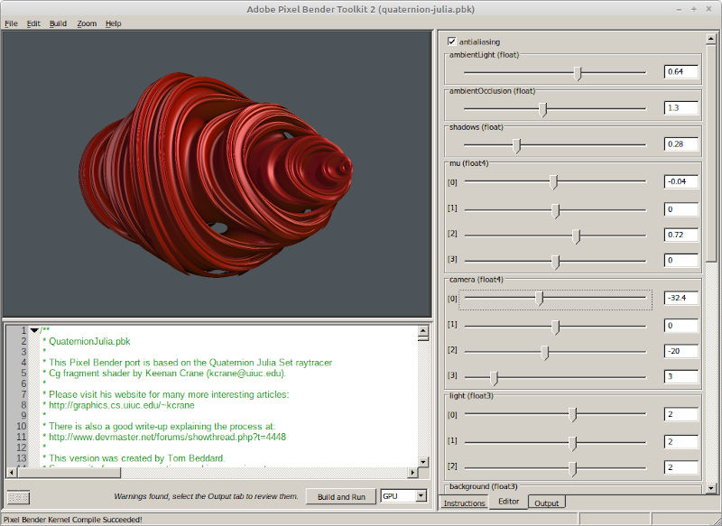

# pb2zig

Pb2zig is a source-to-source translater that takes a Pixel Bender kernel (PBK) and translates it
into the [Zig language](https://ziglang.org/). That code can then be compiled using the Zig
compiler into WASM, making the code available for use in a web environment.

The base project, [pb2zig](./pb2zig/README.md), is a library that performs the translation. It
comes with a CLI program for turning .pbk files into .zig.

Meanwhile, [rollup-plugin-pb2zig](./rollup-plugin-pb2zig/README.md) is a
[Rollup](https://rollupjs.org/) plugin that fully automates the compilation process, such that
all you have to do is write an import statement in your JavaScript file to make use of a PB kernel
in your React or Svelt project.

## What is Pixel Bender?

Pixel Bender was a technology developed by Adobe more than a decade ago for use in their range of
products, from Photoshop to Flash. Adobe's documentation describes it as follows:

> Adobe Pixel Bender is a programming language that is used to create or manipulate image content.
> Using Pixel Bender you create a kernel, also known as a shader. The shader defines a single
> function that executes on each of the pixels of an image individually. The result of each call
> to the function is the output color at that pixel coordinate in the image. Input images and
> parameter values can be specified to customize the operation. In a single execution of a shader,
> input and parameter values are constant. The only thing that varies is the coordinate of the
> pixel whose color is the result of the function call.

Check out the [Pixel Bender specification](https://www.mcjones.org/paul/PixelBenderReference.pdf)
for a complete low-down on this domain-specific language.

The Adobe Pixel Bender Toolkit cames with a nice interactive tool that helps you develop PB
kernels:



GPU acceleration meant that even complicated kernels could execute in the blink of an eye. This
product is sadly no longer available for download from Adobe's website. If you look hard enough
though, you can still find it somewhere on the Internet. And yes, the Windows version does run
properly under Wine.

## Basic example

The following is a simple example of a PB kernel:

```
<languageVersion : 1.0;>

kernel adjust
<
    namespace : "example";
    vendor : "example";
    version : 1;
>
{
    input image4 src;
    output pixel4 dst;

    parameter float3 multipliers
    <
       minValue:     float3(0.0, 0.0, 0.0);
       maxValue:     float3(5.0, 5.0, 5.0);
       defaultValue: float3(1.5, 1.0, 1.0);
       description:  "multiplier for RGB channels";
    >;

    void
    evaluatePixel()
    {
        dst = sampleNearest(src, outCoord());
        dst.rgb *= multipliers;
    }
}
```

The kernel accepts one parameter, `multipliers`, is a vector of three floating point numbers.
The `evaluatePixel()` function samples the input image at the same coordinates as the output
pixel. It then multiplies the RGB channels by `multipliers`, leaving alone the alpha channel.
The default value of `multipliers` would make an image more reddish.

## Pixel Bender Highlights

Here are some examples of what can be done using Pixel Bender. Click on the "Live Demo" links to
see them in action in your browser and see how changing their parameters affects the output. The
demo web-apps should work on any non-ancient mobile phone.

### chihuly

> by Justin Everett-Church
>
> Chihuly themed transition

| Source image                               | Result |
|--------------------------------------------|--------|
| ||

[Live Demo](https://chung-leong.github.io/pb2zig/demo-1/?f=chihuly) |
[Source](./rollup-plugin-pb2zig/demos/demo-1/pbk/chihuly.pbk)

### circle-pattern

> by Petri Leskinen
>
> CirclePattern

| Source image                               | Result |
|--------------------------------------------|--------|
| ||

[Live Demo](https://chung-leong.github.io/pb2zig/demo-1/?f=circle-pattern) |
[Source](./rollup-plugin-pb2zig/demos/demo-1/pbk/circle-pattern.pbk)

### complex-rational

> by pixelero
>
> complex mapping f(z)= (az2+b)/(cz2+d)

| Source image                               | Result |
|--------------------------------------------|--------|
| ||

[Live Demo](https://chung-leong.github.io/pb2zig/demo-1/?f=complex-rational) |
[Source](./rollup-plugin-pb2zig/demos/demo-1/pbk/complex-rational.pbk)

### crystallize

> by Petri Leskinen
>
> Crystallize -filter

| Source image                               | Result |
|--------------------------------------------|--------|
| ||

[Live Demo](https://chung-leong.github.io/pb2zig/demo-1/?f=crystallize) |
[Live Video Demo](https://chung-leong.github.io/pb2zig/demo-5/?f=crystallize) |
[Source](./rollup-plugin-pb2zig/demos/demo-1/pbk/crystallize.pbk)

### droste

> by Tom Beddard
>
> The Droste effect.

| Source image                   | Result |
|--------------------------------|--------|
| ||

[Live Demo](https://chung-leong.github.io/pb2zig/demo-4/?f=droste) |
[Source](./rollup-plugin-pb2zig/demos/demo-1/pbk/droste.pbk)

### hex-cells

> by Petri Leskinen
>
> Hexagonal Tiling

| Source image                               | Result |
|--------------------------------------------|--------|
| ||

[Live Demo](https://chung-leong.github.io/pb2zig/demo-1/?f=hex-cells) |
[Source](./rollup-plugin-pb2zig/demos/demo-1/pbk/hex-cells.pbk)

### pencil

> by Alan Ross
>
> Pencil

| Source image                               | Result |
|--------------------------------------------|--------|
| ||

[Live Demo](https://chung-leong.github.io/pb2zig/demo-1/?f=pencil) |
[Live Video Demo](https://chung-leong.github.io/pb2zig/demo-5/?f=pencil) |
[Source](./rollup-plugin-pb2zig/demos/demo-1/pbk/pencil.pbk)

### posterize

> by Posterizer
>
> Posterizes an image using 2 to 8 specified colors

| Source image                               | Result |
|--------------------------------------------|--------|
| ||

[Live Demo](https://chung-leong.github.io/pb2zig/demo-1/?f=posterize) |
[Source](./rollup-plugin-pb2zig/demos/demo-1/pbk/posterize.pbk)

### sepia

> by Adobe Systems
>
> A variable sepia filter

| Source image                               | Result |
|--------------------------------------------|--------|
| ||

[Live Demo](https://chung-leong.github.io/pb2zig/demo-1/?f=sepia) |
[Source](./rollup-plugin-pb2zig/demos/demo-1/pbk/sepia.pbk)

### wave

> by nicoptere
>
> Wave

| Source image                               | Result |
|--------------------------------------------|--------|
| ||

[Live Demo](https://chung-leong.github.io/pb2zig/demo-1/?f=wave) |
[Source](./rollup-plugin-pb2zig/demos/demo-1/pbk/wave.pbk)

### asciimii

> by Richard Zurad
>
> Filter to mimic the TEXTp effect from YouTube's 2010 April Fools joke

| Source images                              | Result |
|--------------------------------------------|--------|
| ||
|          |        |

[Live Demo](https://chung-leong.github.io/pb2zig/demo-2/?f=asciimii&i2=fontmap&i2=fontmap) |
[Live Video Demo](https://chung-leong.github.io/pb2zig/demo-6/?f=asciimii&i2=fontmap) |
[Source](./rollup-plugin-pb2zig/demos/demo-2/pbk/asciimii.pbk)

### bumpmap

> by Elias Stehle
>
> Bumpmap Shader - Stunning effects on texture-like inputs

| Source images                      | Result |
|------------------------------------|--------|
| ||
|     |        |

[Live Demo](https://chung-leong.github.io/pb2zig/demo-2/?f=bumpmap&i1=zig-logo&i2=wood) |
[Source](./rollup-plugin-pb2zig/demos/demo-2/pbk/bumpmap.pbk)

### metallic

> by Petri Leskinen
>
> Metallic -effect

| Source images                        | Result |
|--------------------------------------|--------|
|   ||
| |   |        |


[Live Demo](https://chung-leong.github.io/pb2zig/demo-2/?f=metallic&i1=zig-logo&i2=stripe) |
[Source](./rollup-plugin-pb2zig/demos/demo-2/pbk/metallic.pbk)

### mandelbulb-quick

> by Tom Beddard
>
> Mandelbulb Fractal Ray Tracer - the quick version

| Result |
|--------|
||

[Live Demo](https://chung-leong.github.io/pb2zig/demo-3/?f=mandelbulb-quick) |
[Source](./rollup-plugin-pb2zig/demos/demo-3/pbk/mandelbulb-quick.pbk)

### newton-raphson

> by Om Labs
>
> Newton Raphson Fractals

| Result |
|--------|
||

[Live Demo](https://chung-leong.github.io/pb2zig/demo-3/?f=newton-raphson) |
[Source](./rollup-plugin-pb2zig/demos/demo-3/pbk/newton-raphson.pbk)

### raytracer

> by Newgrounds
>
> Pixel Blender Raytracing

| Result |
|--------|
||

[Live Demo](https://chung-leong.github.io/pb2zig/demo-3/?f=raytracer) |
[Source](./rollup-plugin-pb2zig/demos/demo-3/pbk/raytracer.pbk)

---

Additional examples can be found at the following pages:

* [Single-image kernels](./single-image.md)
* [Multi-image kernels](./multi-image.md)
* [Rendering kernels](./rendering.md)
