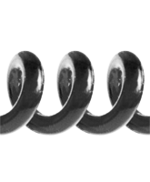

### asciimii

| Source images                              | Result |
|--------------------------------------------|--------|
| ||
|          |        |

[Live Demo](https://chung-leong.github.io/pb2zig/demo-2/?f=asciimii) |
[Source](../rollup-plugin-pb2zig/demos/demo-2/pbk/asciimii.pbk)

### bezier-aligner

| Source images                              | Result |
|--------------------------------------------|--------|
| ||
|   |        |

[Live Demo](https://chung-leong.github.io/pb2zig/demo-2/?f=bezier-aligner) |
[Source](../rollup-plugin-pb2zig/demos/demo-2/pbk/bezier-aligner.pbk)

### blendmode-color

| Source images                              | Result |
|--------------------------------------------|--------|
| ||
|       |        |

[Live Demo](https://chung-leong.github.io/pb2zig/demo-2/?f=blendmode-color) |
[Source](../rollup-plugin-pb2zig/demos/demo-2/pbk/blendmode-color.pbk)

### blendmode-color2

| Source images                              | Result |
|--------------------------------------------|--------|
| ||
|       |        |

[Live Demo](https://chung-leong.github.io/pb2zig/demo-2/?f=blendmode-color2) |
[Source](../rollup-plugin-pb2zig/demos/demo-2/pbk/blendmode-color2.pbk)

### bumpmap

| Source images                      | Result |
|------------------------------------|--------|
| ||
|     |        |

[Live Demo](https://chung-leong.github.io/pb2zig/demo-2/?f=bumpmap) |
[Source](../rollup-plugin-pb2zig/demos/demo-2/pbk/bumpmap.pbk)

### color

| Source images                              | Result |
|--------------------------------------------|--------|
| ||
|       |        |

[Live Demo](https://chung-leong.github.io/pb2zig/demo-2/?f=color) |
[Source](../rollup-plugin-pb2zig/demos/demo-2/pbk/color.pbk)

### color-burn

| Source images                              | Result |
|--------------------------------------------|--------|
| ||
|       |        |

[Live Demo](https://chung-leong.github.io/pb2zig/demo-2/?f=color-burn) |
[Source](../rollup-plugin-pb2zig/demos/demo-2/pbk/color-burn.pbk)

### color-dodge

| Source images                              | Result |
|--------------------------------------------|--------|
| ||
|       |        |

[Live Demo](https://chung-leong.github.io/pb2zig/demo-2/?f=color-dodge) |
[Source](../rollup-plugin-pb2zig/demos/demo-2/pbk/color-dodge.pbk)

### crossfade

| Source images                               | Result |
|---------------------------------------------|--------|
|  ||
| |        |

[Live Demo](https://chung-leong.github.io/pb2zig/demo-2/?f=crossfade) |
[Source](../rollup-plugin-pb2zig/demos/demo-2/pbk/crossfade.pbk)

### displace

| Source images                              | Result |
|--------------------------------------------|--------|
| ||
| |     |        |

[Live Demo](https://chung-leong.github.io/pb2zig/demo-2/?f=displace) |
[Source](../rollup-plugin-pb2zig/demos/demo-2/pbk/displace.pbk)

### exclusion

| Source images                              | Result |
|--------------------------------------------|--------|
| ||
| |     |        |

[Live Demo](https://chung-leong.github.io/pb2zig/demo-2/?f=exclusion) |
[Source](../rollup-plugin-pb2zig/demos/demo-2/pbk/exclusion.pbk)

### luminosity

| Source images                              | Result |
|--------------------------------------------|--------|
| ||
| |     |        |

[Live Demo](https://chung-leong.github.io/pb2zig/demo-2/?f=luminosity) |
[Source](../rollup-plugin-pb2zig/demos/demo-2/pbk/luminosity.pbk)

### metallic

| Source images                        | Result |
|--------------------------------------|--------|
|   ||
| |   |        |

[Live Demo](https://chung-leong.github.io/pb2zig/demo-2/?f=metallic) |
[Source](../rollup-plugin-pb2zig/demos/demo-2/pbk/metallic.pbk)

### saturation

| Source images                              | Result |
|--------------------------------------------|--------|
| ||
| |     |        |

[Live Demo](https://chung-leong.github.io/pb2zig/demo-2/?f=saturation) |
[Source](../rollup-plugin-pb2zig/demos/demo-2/pbk/saturation.pbk)

### soft-light

| Source images                              | Result |
|--------------------------------------------|--------|
| ||
| |     |        |

[Live Demo](https://chung-leong.github.io/pb2zig/demo-2/?f=soft-light) |
[Source](../rollup-plugin-pb2zig/demos/demo-2/pbk/soft-light.pbk)

