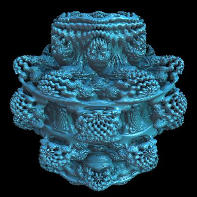
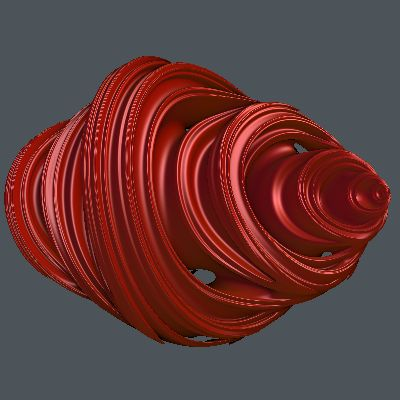

### fractal-explorer

| Result |
|--------|
||

[Live Demo](https://chung-leong.github.io/pb2zig/demo-3/?f=fractal-explorer) |
[Source](../rollup-plugin-pb2zig/demos/demo-3/pbk/fractal-explorer.pbk)

### landscape

| Result |
|--------|
||

[Live Demo](https://chung-leong.github.io/pb2zig/demo-3/?f=landscape) |
[Source](../rollup-plugin-pb2zig/demos/demo-3/pbk/landscape.pbk)

### mandelbulb

| Result |
|--------|
||

[Live Demo](https://chung-leong.github.io/pb2zig/demo-3/?f=mandelbulb) |
[Source](../rollup-plugin-pb2zig/demos/demo-3/pbk/mandelbulb.pbk)

### mandelbulb-quick

| Result |
|--------|
||

[Live Demo](https://chung-leong.github.io/pb2zig/demo-3/?f=mandelbulb-quick) |
[Source](../rollup-plugin-pb2zig/demos/demo-3/pbk/mandelbulb-quick.pbk)

### newton-raphson

| Result |
|--------|
||

[Live Demo](https://chung-leong.github.io/pb2zig/demo-3/?f=newton-raphson) |
[Source](../rollup-plugin-pb2zig/demos/demo-3/pbk/newton-raphson.pbk)

### plasma

| Result |
|--------|
||

[Live Demo](https://chung-leong.github.io/pb2zig/demo-3/?f=plasma) |
[Source](../rollup-plugin-pb2zig/demos/demo-3/pbk/plasma.pbk)

### quaternion-julia

| Result |
|--------|
||

[Live Demo](https://chung-leong.github.io/pb2zig/demo-3/?f=quaternion-julia) |
[Source](../rollup-plugin-pb2zig/demos/demo-3/pbk/quaternion-julia.pbk)

### raytracer

| Result |
|--------|
||

[Live Demo](https://chung-leong.github.io/pb2zig/demo-3/?f=raytracer) |
[Source](../rollup-plugin-pb2zig/demos/demo-3/pbk/raytracer.pbk)

### rt-julia

| Result |
|--------|
||

[Live Demo](https://chung-leong.github.io/pb2zig/demo-3/?f=rt-julia) |
[Source](../rollup-plugin-pb2zig/demos/demo-3/pbk/rt-julia.pbk)

