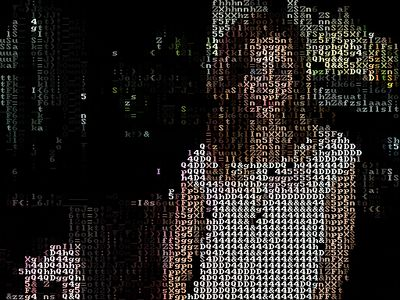
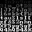
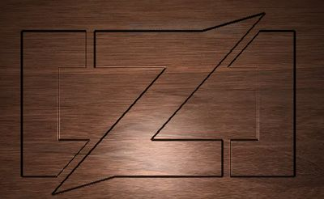

## Multi-image kernels

The following examples accept two images as input and produce a single image as output.
Processing is performed in one web worker. The code of the demo app can be found
[here](./rollup-plugin-pb2zig/demos/demo-2/src/App.jsx).

### asciimii

> by Richard Zurad
>
> Filter to mimic the TEXTp effect from YouTube's 2010 April Fools joke

| Source images                              | Result |
|--------------------------------------------|--------|
| ||
|          |        |

[Live Demo](https://chung-leong.github.io/pb2zig/demo-2/?f=asciimii&i2=fontmap&i2=fontmap) |
[Source](../rollup-plugin-pb2zig/demos/demo-2/pbk/asciimii.pbk)

### bezier-aligner

> by Petri Leskinen
>
> Draws an Image along a Bezier Curve

| Source images                              | Result |
|--------------------------------------------|--------|
| ||
|   |        |

[Live Demo](https://chung-leong.github.io/pb2zig/demo-2/?f=bezier-aligner&i2=telephone-cord&w2=imagewidth) |
[Source](../rollup-plugin-pb2zig/demos/demo-2/pbk/bezier-aligner.pbk)

### blendmode-color

> by Quasimondo
>
> Color Blendmode

| Source images                              | Result |
|--------------------------------------------|--------|
| ||
|       |        |

[Live Demo](https://chung-leong.github.io/pb2zig/demo-2/?f=blendmode-color) |
[Source](../rollup-plugin-pb2zig/demos/demo-2/pbk/blendmode-color.pbk)

### blendmode-color2

> by Quasimondo
>
> Alternative Color Blendmode

| Source images                              | Result |
|--------------------------------------------|--------|
| ||
|       |        |

[Live Demo](https://chung-leong.github.io/pb2zig/demo-2/?f=blendmode-color2) |
[Source](../rollup-plugin-pb2zig/demos/demo-2/pbk/blendmode-color2.pbk)

### bumpmap

> by Elias Stehle
>
> Bumpmap Shader - Stunning effects on texture-like inputs

| Source images                      | Result |
|------------------------------------|--------|
| ||
|     |        |

[Live Demo](https://chung-leong.github.io/pb2zig/demo-2/?f=bumpmap&i1=zig-logo&i2=wood) |
[Source](../rollup-plugin-pb2zig/demos/demo-2/pbk/bumpmap.pbk)

### color

> by Adobe
>
> Color blend mode

| Source images                              | Result |
|--------------------------------------------|--------|
| ||
|       |        |

[Live Demo](https://chung-leong.github.io/pb2zig/demo-2/?f=color) |
[Source](../rollup-plugin-pb2zig/demos/demo-2/pbk/color.pbk)

### color-burn

> by Adobe
>
> ColorBurn blend mode

| Source images                              | Result |
|--------------------------------------------|--------|
| ||
|       |        |

[Live Demo](https://chung-leong.github.io/pb2zig/demo-2/?f=color-burn) |
[Source](../rollup-plugin-pb2zig/demos/demo-2/pbk/color-burn.pbk)

### color-dodge

> by Adobe
>
> ColorDodge blend mode

| Source images                              | Result |
|--------------------------------------------|--------|
| ||
|       |        |

[Live Demo](https://chung-leong.github.io/pb2zig/demo-2/?f=color-dodge) |
[Source](../rollup-plugin-pb2zig/demos/demo-2/pbk/color-dodge.pbk)

### crossfade

> by Adobe Systems
>
> Crossfade between two images

| Source images                               | Result |
|---------------------------------------------|--------|
|  ||
| |        |

[Live Demo](https://chung-leong.github.io/pb2zig/demo-2/?f=crossfade&i2=malgorzata-socha2) |
[Source](../rollup-plugin-pb2zig/demos/demo-2/pbk/crossfade.pbk)

### displace

> by nicoptere
>
> Displace

| Source images                              | Result |
|--------------------------------------------|--------|
| ||
| |     |        |

[Live Demo](https://chung-leong.github.io/pb2zig/demo-2/?f=displace) |
[Source](../rollup-plugin-pb2zig/demos/demo-2/pbk/displace.pbk)

### exclusion

> by Adobe
>
> Exclusion blend mode

| Source images                              | Result |
|--------------------------------------------|--------|
| ||
| |     |        |

[Live Demo](https://chung-leong.github.io/pb2zig/demo-2/?f=exclusion) |
[Source](../rollup-plugin-pb2zig/demos/demo-2/pbk/exclusion.pbk)

### luminosity

> by Adobe
>
> Luminosity blend mode

| Source images                              | Result |
|--------------------------------------------|--------|
| ||
| |     |        |

[Live Demo](https://chung-leong.github.io/pb2zig/demo-2/?f=luminosity) |
[Source](../rollup-plugin-pb2zig/demos/demo-2/pbk/luminosity.pbk)

### metallic

> by Petri Leskinen
>
> Metallic -effect

| Source images                        | Result |
|--------------------------------------|--------|
|   ||
| |   |        |

[Live Demo](https://chung-leong.github.io/pb2zig/demo-2/?f=metallic&i1=zig-logo&i2=stripe) |
[Source](../rollup-plugin-pb2zig/demos/demo-2/pbk/metallic.pbk)

### saturation

> by Adobe
>
> Saturation blend mode

| Source images                              | Result |
|--------------------------------------------|--------|
| ||
| |     |        |

[Live Demo](https://chung-leong.github.io/pb2zig/demo-2/?f=saturation) |
[Source](../rollup-plugin-pb2zig/demos/demo-2/pbk/saturation.pbk)

### soft-light

> by Adobe
>
> SoftLight blend mode

| Source images                              | Result |
|--------------------------------------------|--------|
| ||
| |     |        |

[Live Demo](https://chung-leong.github.io/pb2zig/demo-2/?f=soft-light) |
[Source](../rollup-plugin-pb2zig/demos/demo-2/pbk/soft-light.pbk)

