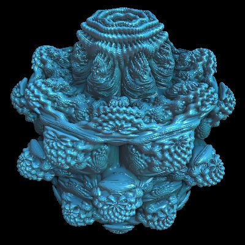
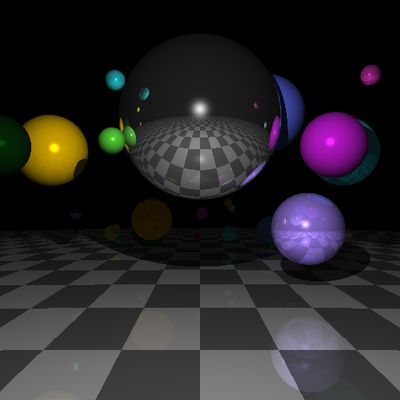

## Rendering kernels

The following examples accept no input images as input. They generate the output image from
scratch, based on the parameters given. Processing is performed in multiple web workers, as many as
eight if your CPU has that many cores. The code of the demo app can be found
[here](./rollup-plugin-pb2zig/demos/demo-3/src/App.jsx).

### fractal-explorer

> by Tom Beddard
>
> Fractal explorer

| Result |
|--------|
||

[Live Demo](https://zigar.net/pb2zig/demo-3/?f=fractal-explorer) |
[Source](./rollup-plugin-pb2zig/demos/demo-3/pbk/fractal-explorer.pbk)

### landscape

> by Tom Beddard
>
> Landscape rendering using ray marching

| Result |
|--------|
||

[Live Demo](https://zigar.net/pb2zig/demo-3/?f=landscape) |
[Source](./rollup-plugin-pb2zig/demos/demo-3/pbk/landscape.pbk)

### mandelbulb

> by Tom Beddard
>
> Mandelbulb Fractal Ray Tracer - the full version

| Result |
|--------|
||

[Live Demo](https://zigar.net/pb2zig/demo-3/?f=mandelbulb) |
[Source](./rollup-plugin-pb2zig/demos/demo-3/pbk/mandelbulb.pbk)

### mandelbulb-quick

> by Tom Beddard
>
> Mandelbulb Fractal Ray Tracer - the quick version

| Result |
|--------|
||

[Live Demo](https://zigar.net/pb2zig/demo-3/?f=mandelbulb-quick) |
[Source](./rollup-plugin-pb2zig/demos/demo-3/pbk/mandelbulb-quick.pbk)

### newton-raphson

> by Om Labs
>
> Newton Raphson Fractals

| Result |
|--------|
||

[Live Demo](https://zigar.net/pb2zig/demo-3/?f=newton-raphson) |
[Source](./rollup-plugin-pb2zig/demos/demo-3/pbk/newton-raphson.pbk)

### plasma

> by Mr.doob
>
> Good old plasma effect

| Result |
|--------|
||

[Live Demo](https://zigar.net/pb2zig/demo-3/?f=plasma) |
[Source](./rollup-plugin-pb2zig/demos/demo-3/pbk/plasma.pbk)

### quaternion-julia

> by Tom Beddard
>
> Quaternion Julia Ray Tracer

| Result |
|--------|
||

[Live Demo](https://zigar.net/pb2zig/demo-3/?f=quaternion-julia) |
[Source](./rollup-plugin-pb2zig/demos/demo-3/pbk/quaternion-julia.pbk)

### raytracer

> by Newgrounds
>
> Pixel Blender Raytracing

| Result |
|--------|
||

[Live Demo](https://zigar.net/pb2zig/demo-3/?f=raytracer) |
[Source](./rollup-plugin-pb2zig/demos/demo-3/pbk/raytracer.pbk)

### rt-julia

> by Der Schmale
>
> Raytraces a Quaternion Julia set

| Result |
|--------|
||

[Live Demo](https://zigar.net/pb2zig/demo-3/?f=rt-julia) |
[Source](./rollup-plugin-pb2zig/demos/demo-3/pbk/rt-julia.pbk)

