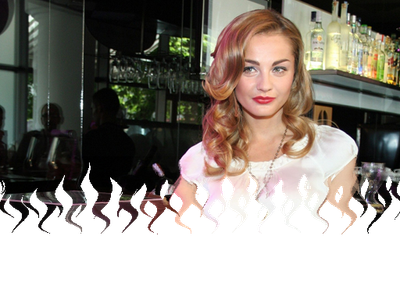
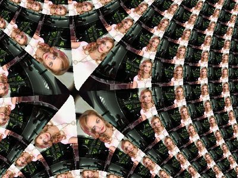
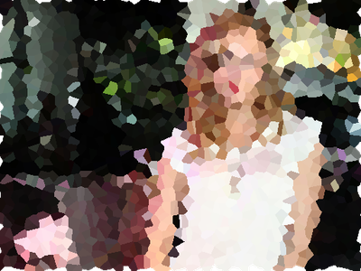
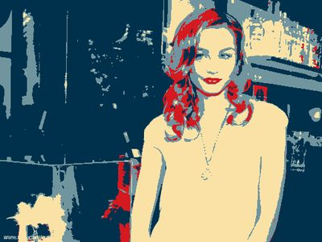

## Single-image kernels

The following examples accept a single image as input and produce a single image as output.
Processing is performed in one web worker. The code of the demo app can be found
[here](./rollup-plugin-pb2zig/demos/demo-1/src/App.jsx).

The Droste PBK is the only exception. Due to the high computational requirement, the output
image is divided in 8 chunks, processed in the same number of web workers as the number of
core in your CPU. You can find the code [here](./rollup-plugin-pb2zig/demos/demo-4/src/App.jsx).

### advanced-stereographic

> by Frank Reitberger
>
> Advanced stereographic projection enhanced by warp(s), turn(s), scale(s) & zoom(s)

| Source image                               | Result |
|--------------------------------------------|--------|
| ||

[Live Demo](https://chung-leong.github.io/pb2zig/demo-1/?f=advanced-stereographic) |
[Source](./rollup-plugin-pb2zig/demos/demo-1/pbk/advanced-stereographic.pbk)

### alpha-from-max-color

> by Adobe Systems Incorporated`
>
> Estimate alpha based on color channels.

| Source image                               | Result |
|--------------------------------------------|--------|
| ||

[Live Demo](https://chung-leong.github.io/pb2zig/demo-1/?f=alpha-from-max-color) |
[Source](./rollup-plugin-pb2zig/demos/demo-1/pbk/alpha-from-max-color.pbk)

### bilateral-blur

> by Andy Li
>
> Bilateral Blur.

| Source image                               | Result |
|--------------------------------------------|--------|
| ||

[Live Demo](https://chung-leong.github.io/pb2zig/demo-1/?f=bilateral-blur) |
[Source](./rollup-plugin-pb2zig/demos/demo-1/pbk/bilateral-blur.pbk)

### brightness-threshold

> by Andy Li
>
> Thresholding bases on brightness.

| Source image                               | Result |
|--------------------------------------------|--------|
| ||

[Live Demo](https://chung-leong.github.io/pb2zig/demo-1/?f=brightness-threshold) |
[Source](./rollup-plugin-pb2zig/demos/demo-1/pbk/brightness-threshold.pbk)

### bulge

> by nicoptere
>
> bulge

| Source image                               | Result |
|--------------------------------------------|--------|
| ||

[Live Demo](https://chung-leong.github.io/pb2zig/demo-1/?f=bulge) |
[Source](./rollup-plugin-pb2zig/demos/demo-1/pbk/bulge.pbk)

### cassini

> by Frank Reitberger
>
> cassini pattern

| Source image                               | Result |
|--------------------------------------------|--------|
| ||

[Live Demo](https://chung-leong.github.io/pb2zig/demo-1/?f=cassini) |
[Source](./rollup-plugin-pb2zig/demos/demo-1/pbk/cassini.pbk)

### channel-threshold

> by Andy Li
>
> Thresholding bases on the channels. Only the pixels passed ALL thresholds will be white (or color
you configed).

| Source image                               | Result |
|--------------------------------------------|--------|
| ||

[Live Demo](https://chung-leong.github.io/pb2zig/demo-1/?f=channel-threshold) |
[Source](./rollup-plugin-pb2zig/demos/demo-1/pbk/channel-threshold.pbk)

### chihuly

> by Justin Everett-Church
>
> Chihuly themed transition

| Source image                               | Result |
|--------------------------------------------|--------|
| ||

[Live Demo](https://chung-leong.github.io/pb2zig/demo-1/?f=chihuly) |
[Source](./rollup-plugin-pb2zig/demos/demo-1/pbk/chihuly.pbk)

### circle-pattern

> by Petri Leskinen
>
> CirclePattern

| Source image                               | Result |
|--------------------------------------------|--------|
| ||

[Live Demo](https://chung-leong.github.io/pb2zig/demo-1/?f=circle-pattern) |
[Source](./rollup-plugin-pb2zig/demos/demo-1/pbk/circle-pattern.pbk)

### circle-pixels

> by Neuro Productions
>
> circlePixels

| Source image                               | Result |
|--------------------------------------------|--------|
| ||

[Live Demo](https://chung-leong.github.io/pb2zig/demo-1/?f=circle-pixels) |
[Source](./rollup-plugin-pb2zig/demos/demo-1/pbk/circle-pixels.pbk)

### circular-disks

> by Petri Leskinen
>
> Disk tiling

| Source image                               | Result |
|--------------------------------------------|--------|
| ||

[Live Demo](https://chung-leong.github.io/pb2zig/demo-1/?f=circular-disks) |
[Source](./rollup-plugin-pb2zig/demos/demo-1/pbk/circular-disks.pbk)

### complex-inverse

> by pixelero
>
> complex mapping z = d/[(z-a)(z-b)(z-c)]

| Source image                               | Result |
|--------------------------------------------|--------|
| ||

[Live Demo](https://chung-leong.github.io/pb2zig/demo-1/?f=complex-inverse) |
[Source](./rollup-plugin-pb2zig/demos/demo-1/pbk/complex-inverse.pbk)

### complex-rational

> by pixelero
>
> complex mapping f(z)= (az2+b)/(cz2+d)

| Source image                               | Result |
|--------------------------------------------|--------|
| ||

[Live Demo](https://chung-leong.github.io/pb2zig/demo-1/?f=complex-rational) |
[Source](./rollup-plugin-pb2zig/demos/demo-1/pbk/complex-rational.pbk)

### cross-stitch

> by ghostRadio.net
>
> Cross-stitch effect

| Source image                               | Result |
|--------------------------------------------|--------|
| ||

[Live Demo](https://chung-leong.github.io/pb2zig/demo-1/?f=cross-stitch) |
[Source](./rollup-plugin-pb2zig/demos/demo-1/pbk/cross-stitch.pbk)

### crystallize

> by Petri Leskinen
>
> Crystallize -filter

| Source image                               | Result |
|--------------------------------------------|--------|
| ||

[Live Demo](https://chung-leong.github.io/pb2zig/demo-1/?f=crystallize) |
[Live Video Demo](https://chung-leong.github.io/pb2zig/demo-5/?f=crystallize) |
[Source](./rollup-plugin-pb2zig/demos/demo-1/pbk/crystallize.pbk)

### cubes-03

> by omino.com
>
> spheresection

| Source image                               | Result |
|--------------------------------------------|--------|
| ||

[Live Demo](https://chung-leong.github.io/pb2zig/demo-1/?f=cubes-03) |
[Source](./rollup-plugin-pb2zig/demos/demo-1/pbk/cubes-03.pbk)

### cubic-space

> by Petri Leskinen
>
> cubicspace

| Source image                               | Result |
|--------------------------------------------|--------|
| ||

[Live Demo](https://chung-leong.github.io/pb2zig/demo-1/?f=cubic-space) |
[Source](./rollup-plugin-pb2zig/demos/demo-1/pbk/cubic-space.pbk)

### deformer

> by Frank Reitberger
>
> deforms whatever gets in the way.

| Source image                               | Result |
|--------------------------------------------|--------|
| ||

[Live Demo](https://chung-leong.github.io/pb2zig/demo-1/?f=deformer) |
[Source](./rollup-plugin-pb2zig/demos/demo-1/pbk/deformer.pbk)

### difference-key

> by Quasimondo
>
> A simple difference key for chroma keying

| Source image                               | Result |
|--------------------------------------------|--------|
| ||

[Live Demo](https://chung-leong.github.io/pb2zig/demo-1/?f=difference-key) |
[Source](./rollup-plugin-pb2zig/demos/demo-1/pbk/difference-key.pbk)

### dilate-circle

> by gasubasu
>
> flash compatible dilate filter 'circle'

| Source image                               | Result |
|--------------------------------------------|--------|
| ||

[Live Demo](https://chung-leong.github.io/pb2zig/demo-1/?f=dilate-circle) |
[Source](./rollup-plugin-pb2zig/demos/demo-1/pbk/dilate-circle.pbk)

### dilate-cross

> by gasubasu
>
> flash compatible dilate filter 'cross'

| Source image                               | Result |
|--------------------------------------------|--------|
| ||

[Live Demo](https://chung-leong.github.io/pb2zig/demo-1/?f=dilate-cross) |
[Source](./rollup-plugin-pb2zig/demos/demo-1/pbk/dilate-cross.pbk)

### dilate-diamond

> by gasubasu
>
> flash compatible dilate filter 'diamond'

| Source image                               | Result |
|--------------------------------------------|--------|
| ||

[Live Demo](https://chung-leong.github.io/pb2zig/demo-1/?f=dilate-diamond) |
[Source](./rollup-plugin-pb2zig/demos/demo-1/pbk/dilate-diamond.pbk)

### dilate-quad

> by gasubasu
>
> flash compatible dilate filter 'quad'

| Source image                               | Result |
|--------------------------------------------|--------|
| ||

[Live Demo](https://chung-leong.github.io/pb2zig/demo-1/?f=dilate-quad) |
[Source](./rollup-plugin-pb2zig/demos/demo-1/pbk/dilate-quad.pbk)

### disks

> by Petri Leskinen
>
> Disk tiling

| Source image                               | Result |
|--------------------------------------------|--------|
| ||

[Live Demo](https://chung-leong.github.io/pb2zig/demo-1/?f=disks) |
[Source](./rollup-plugin-pb2zig/demos/demo-1/pbk/disks.pbk)

### droste

> by Tom Beddard
>
> The Droste effect.

| Source image                   | Result |
|--------------------------------|--------|
| ||

[Live Demo](https://chung-leong.github.io/pb2zig/demo-4/?f=droste) |
[Source](./rollup-plugin-pb2zig/demos/demo-1/pbk/droste.pbk)

### dynamic-palette

> by Eduardo Costa
>
> Manipulates the Color Palette of the bitmap

| Source image                               | Result |
|--------------------------------------------|--------|
| ||

[Live Demo](https://chung-leong.github.io/pb2zig/demo-1/?f=dynamic-palette) |
[Source](./rollup-plugin-pb2zig/demos/demo-1/pbk/dynamic-palette.pbk)

### erode-circle

> by gasubasu
>
> flash compatible erode filter 'circle'

| Source image                               | Result |
|--------------------------------------------|--------|
| ||

[Live Demo](https://chung-leong.github.io/pb2zig/demo-1/?f=erode-circle) |
[Source](./rollup-plugin-pb2zig/demos/demo-1/pbk/erode-circle.pbk)

### erode-cross

> by gasubasu
>
> flash compatible erode filter 'cross'

| Source image                               | Result |
|--------------------------------------------|--------|
| ||

[Live Demo](https://chung-leong.github.io/pb2zig/demo-1/?f=erode-cross) |
[Source](./rollup-plugin-pb2zig/demos/demo-1/pbk/erode-cross.pbk)

### erode-diamond

> by gasubasu
>
> flash compatible erode filter 'diamond'

| Source image                               | Result |
|--------------------------------------------|--------|
| ||

[Live Demo](https://chung-leong.github.io/pb2zig/demo-1/?f=erode-diamond) |
[Source](./rollup-plugin-pb2zig/demos/demo-1/pbk/erode-diamond.pbk)

### erode-quad

> by gasubasu
>
> flash compatible erode filter 'quad'

| Source image                               | Result |
|--------------------------------------------|--------|
| ||

[Live Demo](https://chung-leong.github.io/pb2zig/demo-1/?f=erode-quad) |
[Source](./rollup-plugin-pb2zig/demos/demo-1/pbk/erode-quad.pbk)

### escherizer

> by Frank Reitberger
>
> escherizer ...dissected for use with flash

| Source image                               | Result |
|--------------------------------------------|--------|
| ||

[Live Demo](https://chung-leong.github.io/pb2zig/demo-1/?f=escherizer) |
[Source](./rollup-plugin-pb2zig/demos/demo-1/pbk/escherizer.pbk)

### focus-linear-blur

> by Petri Leskinen
>
> linear blur by a line equation

| Source image                               | Result |
|--------------------------------------------|--------|
| ||

[Live Demo](https://chung-leong.github.io/pb2zig/demo-1/?f=focus-linear-blur) |
[Source](./rollup-plugin-pb2zig/demos/demo-1/pbk/focus-linear-blur.pbk)

### fractal-explorer-orbit-traps

> by Tom Beddard
>
> Fractal explorer with orbit traps

| Source image                               | Result |
|--------------------------------------------|--------|
| ||

[Live Demo](https://chung-leong.github.io/pb2zig/demo-1/?f=fractal-explorer-orbit-traps) |
[Source](./rollup-plugin-pb2zig/demos/demo-1/pbk/fractal-explorer-orbit-traps.pbk)

### frei-chen

> by Mario Klingemann
>
> Implementation of Frei-Chen Edge Detection as found on
> http://rastergrid.com/blog/2011/01/frei-chen-edge-detector/

| Source image                               | Result |
|--------------------------------------------|--------|
| ||

[Live Demo](https://chung-leong.github.io/pb2zig/demo-1/?f=frei-chen) |
[Source](./rollup-plugin-pb2zig/demos/demo-1/pbk/frei-chen.pbk)

### green-screen

> by Chung Leong
>
> Removal of green background

| Source image                         | Result |
|--------------------------------------|--------|
| ||

[Live Demo](https://chung-leong.github.io/pb2zig/demo-1/?f=green-screen&i=helicopter) |
[Source](./rollup-plugin-pb2zig/demos/demo-1/pbk/green-screen.pbk)

### hex-cells

> by Petri Leskinen
>
> Hexagonal Tiling

| Source image                               | Result |
|--------------------------------------------|--------|
| ||

[Live Demo](https://chung-leong.github.io/pb2zig/demo-1/?f=hex-cells) |
[Source](./rollup-plugin-pb2zig/demos/demo-1/pbk/hex-cells.pbk)

### high-contrast

> by MimsWright.com
>
> Extreme contrast filter that converts to either 1 or 0 based on brightness of source.

| Source image                               | Result |
|--------------------------------------------|--------|
| ||

[Live Demo](https://chung-leong.github.io/pb2zig/demo-1/?f=high-contrast) |
[Source](./rollup-plugin-pb2zig/demos/demo-1/pbk/high-contrast.pbk)

### hypno

> by Mr.doob
>
> Hypnotic effect

| Source image                               | Result |
|--------------------------------------------|--------|
| ||

[Live Demo](https://chung-leong.github.io/pb2zig/demo-1/?f=hypno) |
[Source](./rollup-plugin-pb2zig/demos/demo-1/pbk/hypno.pbk)

### invert-rgb

> by Adobe Systems, Inc.
>
> Invert the Red, Green and Blue channels of an image

| Source image                               | Result |
|--------------------------------------------|--------|
| ||

[Live Demo](https://chung-leong.github.io/pb2zig/demo-1/?f=invert-rgb) |
[Source](./rollup-plugin-pb2zig/demos/demo-1/pbk/invert-rgb.pbk)

### jitter

> by nicoptere
>
> Jitter

| Source image                               | Result |
|--------------------------------------------|--------|
| ||

[Live Demo](https://chung-leong.github.io/pb2zig/demo-1/?f=jitter) |
[Source](./rollup-plugin-pb2zig/demos/demo-1/pbk/jitter.pbk)

### levels

> by Antti Kupila
>
> Levels filter

| Source image                               | Result |
|--------------------------------------------|--------|
| ||

[Live Demo](https://chung-leong.github.io/pb2zig/demo-1/?f=levels) |
[Source](./rollup-plugin-pb2zig/demos/demo-1/pbk/levels.pbk)

### mercator

> by nicoptere
>
> Mercator

| Source image                               | Result |
|--------------------------------------------|--------|
| ||

[Live Demo](https://chung-leong.github.io/pb2zig/demo-1/?f=mercator) |
[Source](./rollup-plugin-pb2zig/demos/demo-1/pbk/mercator.pbk)

### outline

> by Shogo Kimura

| Source image                               | Result |
|--------------------------------------------|--------|
| ||

[Live Demo](https://chung-leong.github.io/pb2zig/demo-1/?f=outline) |
[Source](./rollup-plugin-pb2zig/demos/demo-1/pbk/outline.pbk)

### outline2

> by Alan Ross
>
> Outline

| Source image                               | Result |
|--------------------------------------------|--------|
| ||

[Live Demo](https://chung-leong.github.io/pb2zig/demo-1/?f=outline2) |
[Source](./rollup-plugin-pb2zig/demos/demo-1/pbk/outline2.pbk)

### painting

> by Alan Ross
>
> Painting

| Source image                               | Result |
|--------------------------------------------|--------|
| ||

[Live Demo](https://chung-leong.github.io/pb2zig/demo-1/?f=painting) |
[Source](./rollup-plugin-pb2zig/demos/demo-1/pbk/painting.pbk)

### pencil

> by Alan Ross
>
> Pencil

| Source image                               | Result |
|--------------------------------------------|--------|
| ||

[Live Demo](https://chung-leong.github.io/pb2zig/demo-1/?f=pencil) |
[Live Video Demo](https://chung-leong.github.io/pb2zig/demo-5/?f=pencil) |
[Source](./rollup-plugin-pb2zig/demos/demo-1/pbk/pencil.pbk)

### pixelate

> by Adobe Systems
>
> Pixelate an image

| Source image                               | Result |
|--------------------------------------------|--------|
| ||

[Live Demo](https://chung-leong.github.io/pb2zig/demo-1/?f=pixelate) |
[Source](./rollup-plugin-pb2zig/demos/demo-1/pbk/pixelate.pbk)

### planes

> by Mr.doob
>
> Planes effect

| Source image                               | Result |
|--------------------------------------------|--------|
| ||

[Live Demo](https://chung-leong.github.io/pb2zig/demo-1/?f=planes) |
[Source](./rollup-plugin-pb2zig/demos/demo-1/pbk/planes.pbk)

### posterize

> by Posterizer
>
> Posterizes an image using 2 to 8 specified colors

| Source image                               | Result |
|--------------------------------------------|--------|
| ||

[Live Demo](https://chung-leong.github.io/pb2zig/demo-1/?f=posterize) |
[Source](./rollup-plugin-pb2zig/demos/demo-1/pbk/posterize.pbk)

### radial-caleidoscope

> by Petri Leskinen
>
> Caleidoscope -effect for radial reflection

| Source image                               | Result |
|--------------------------------------------|--------|
| ||

[Live Demo](https://chung-leong.github.io/pb2zig/demo-1/?f=radial-caleidoscope) |
[Source](./rollup-plugin-pb2zig/demos/demo-1/pbk/radial-caleidoscope.pbk)

### random-pixelation

> by pixelero
>
> Random size pixelation

| Source image                               | Result |
|--------------------------------------------|--------|
| ||

[Live Demo](https://chung-leong.github.io/pb2zig/demo-1/?f=random-pixelation) |
[Source](./rollup-plugin-pb2zig/demos/demo-1/pbk/random-pixelation.pbk)

### rays

> by Mr.doob
>
> Rays effect

| Source image                               | Result |
|--------------------------------------------|--------|
| ||

[Live Demo](https://chung-leong.github.io/pb2zig/demo-1/?f=rays) |
[Source](./rollup-plugin-pb2zig/demos/demo-1/pbk/rays.pbk)

### rays2

> by Mr.doob
>
> Rays effect 2

| Source image                               | Result |
|--------------------------------------------|--------|
| ||

[Live Demo](https://chung-leong.github.io/pb2zig/demo-1/?f=rays2) |
[Source](./rollup-plugin-pb2zig/demos/demo-1/pbk/rays2.pbk)

### ripple-blocks

> by Allen Chou
>
> Box-shaped ripple effect

| Source image                               | Result |
|--------------------------------------------|--------|
| ||

[Live Demo](https://chung-leong.github.io/pb2zig/demo-1/?f=ripple-blocks) |
[Source](./rollup-plugin-pb2zig/demos/demo-1/pbk/ripple-blocks.pbk)

### sepia

> by Adobe Systems
>
> A variable sepia filter

| Source image                               | Result |
|--------------------------------------------|--------|
| ||

[Live Demo](https://chung-leong.github.io/pb2zig/demo-1/?f=sepia) |
[Source](./rollup-plugin-pb2zig/demos/demo-1/pbk/sepia.pbk)

### sharpen

> by Ryan Phelan
>
> Applies a sharpen effect to an image.

| Source image                               | Result |
|--------------------------------------------|--------|
| ||

[Live Demo](https://chung-leong.github.io/pb2zig/demo-1/?f=sharpen) |
[Source](./rollup-plugin-pb2zig/demos/demo-1/pbk/sharpen.pbk)

### simple

| Source image                               | Result |
|--------------------------------------------|--------|
| ||

[Live Demo](https://chung-leong.github.io/pb2zig/demo-1/?f=simple) |
[Source](./rollup-plugin-pb2zig/demos/demo-1/pbk/simple.pbk)

### simple-box-blur

> by Adobe Systems
>
> A simple fixed-size box blur

| Source image                               | Result |
|--------------------------------------------|--------|
| ||

[Live Demo](https://chung-leong.github.io/pb2zig/demo-1/?f=simple-box-blur) |
[Source](./rollup-plugin-pb2zig/demos/demo-1/pbk/simple-box-blur.pbk)

### simple-point-light

> by John Engler
>
> Simple point light--playing with PixelBender

| Source image                               | Result |
|--------------------------------------------|--------|
| ||

[Live Demo](https://chung-leong.github.io/pb2zig/demo-1/?f=simple-point-light) |
[Source](./rollup-plugin-pb2zig/demos/demo-1/pbk/simple-point-light.pbk)

### skin-color-filter

> by Steve Shipman
>
> Skin Color filter

| Source image                               | Result |
|--------------------------------------------|--------|
| ||

[Live Demo](https://chung-leong.github.io/pb2zig/demo-1/?f=skin-color-filter) |
[Source](./rollup-plugin-pb2zig/demos/demo-1/pbk/skin-color-filter.pbk)

### slices

> by nicoptere
>
> Slices

| Source image                               | Result |
|--------------------------------------------|--------|
| ||

[Live Demo](https://chung-leong.github.io/pb2zig/demo-1/?f=slices) |
[Source](./rollup-plugin-pb2zig/demos/demo-1/pbk/slices.pbk)

### smart-normal-map

> by Jan-C. Frischmuth
>
> Generates a normalmap using condensed or sobel-edge.

| Source image                               | Result |
|--------------------------------------------|--------|
| ||

[Live Demo](https://chung-leong.github.io/pb2zig/demo-1/?f=smart-normal-map) |
[Source](./rollup-plugin-pb2zig/demos/demo-1/pbk/smart-normal-map.pbk)

### smart-ssao

> by Jan Frischmuth
>
> Computes screen space ambien occlusion from a depth buffer

| Source image                               | Result |
|--------------------------------------------|--------|
| ||

[Live Demo](https://chung-leong.github.io/pb2zig/demo-1/?f=smart-ssao) |
[Source](./rollup-plugin-pb2zig/demos/demo-1/pbk/smart-ssao.pbk)

### smudger

> by Frank Reitberger
>
> Generates a smudged pattern

| Source image                               | Result |
|--------------------------------------------|--------|
| ||

[Live Demo](https://chung-leong.github.io/pb2zig/demo-1/?f=smudger) |
[Source](./rollup-plugin-pb2zig/demos/demo-1/pbk/smudger.pbk)

### sphere

> by Mr.doob
>
> Sphere effect

| Source image                               | Result |
|--------------------------------------------|--------|
| ||

[Live Demo](https://chung-leong.github.io/pb2zig/demo-1/?f=sphere) |
[Source](./rollup-plugin-pb2zig/demos/demo-1/pbk/sphere.pbk)

### star

| Source image                               | Result |
|--------------------------------------------|--------|
| ||

[Live Demo](https://chung-leong.github.io/pb2zig/demo-1/?f=star) |
[Source](./rollup-plugin-pb2zig/demos/demo-1/pbk/star.pbk)

### tint

> by Allen Chou
>
> Tint effect

| Source image                               | Result |
|--------------------------------------------|--------|
| ||

[Live Demo](https://chung-leong.github.io/pb2zig/demo-1/?f=tint) |
[Source](./rollup-plugin-pb2zig/demos/demo-1/pbk/tint.pbk)

### tunnel

> by Mr.doob
>
> Tunnel effect

| Source image                               | Result |
|--------------------------------------------|--------|
| ||

[Live Demo](https://chung-leong.github.io/pb2zig/demo-1/?f=tunnel) |
[Source](./rollup-plugin-pb2zig/demos/demo-1/pbk/tunnel.pbk)

### tunnel2

> by Mr.doob
>
> Tunnel effect 2

| Source image                               | Result |
|--------------------------------------------|--------|
| ||

[Live Demo](https://chung-leong.github.io/pb2zig/demo-1/?f=tunnel2) |
[Source](./rollup-plugin-pb2zig/demos/demo-1/pbk/tunnel2.pbk)

### tunnel3

> by Mr.doob
>
> Tunnel effect 3

| Source image                               | Result |
|--------------------------------------------|--------|
| ||

[Live Demo](https://chung-leong.github.io/pb2zig/demo-1/?f=tunnel3) |
[Source](./rollup-plugin-pb2zig/demos/demo-1/pbk/tunnel3.pbk)

### tunnel4

> by Mr.doob
>
> Tunnel effect 4

| Source image                               | Result |
|--------------------------------------------|--------|
| ||

[Live Demo](https://chung-leong.github.io/pb2zig/demo-1/?f=tunnel4) |
[Source](./rollup-plugin-pb2zig/demos/demo-1/pbk/tunnel4.pbk)

### twirl

> by Adobe Systems
>
> Twist an image around

| Source image                               | Result |
|--------------------------------------------|--------|
| ||

[Live Demo](https://chung-leong.github.io/pb2zig/demo-1/?f=twirl) |
[Source](./rollup-plugin-pb2zig/demos/demo-1/pbk/twirl.pbk)

### vertical-scroll

> by Tom Byrne

| Source image                               | Result |
|--------------------------------------------|--------|
| ||

[Live Demo](https://chung-leong.github.io/pb2zig/demo-1/?f=vertical-scroll) |
[Source](./rollup-plugin-pb2zig/demos/demo-1/pbk/vertical-scroll.pbk)

### vortex

> by Mr.doob
>
> Vortex effect

| Source image                               | Result |
|--------------------------------------------|--------|
| ||

[Live Demo](https://chung-leong.github.io/pb2zig/demo-1/?f=vortex) |
[Source](./rollup-plugin-pb2zig/demos/demo-1/pbk/vortex.pbk)

### warp

> by Frank Reitberger
>
> Warps image vice versa and back

| Source image                               | Result |
|--------------------------------------------|--------|
| ||

[Live Demo](https://chung-leong.github.io/pb2zig/demo-1/?f=warp) |
[Source](./rollup-plugin-pb2zig/demos/demo-1/pbk/warp.pbk)

### wave

> by nicoptere
>
> Wave

| Source image                               | Result |
|--------------------------------------------|--------|
| ||

[Live Demo](https://chung-leong.github.io/pb2zig/demo-1/?f=wave) |
[Source](./rollup-plugin-pb2zig/demos/demo-1/pbk/wave.pbk)

### zoom-blur-focus

> by Daniel Allegretti
>
> Ajustable zoom blur, you can control focal size, edge hardness and light. Based on ZoomBlur by
> Ryan Phelan.

| Source image                               | Result |
|--------------------------------------------|--------|
| ||

[Live Demo](https://chung-leong.github.io/pb2zig/demo-1/?f=zoom-blur-focus) |
[Source](./rollup-plugin-pb2zig/demos/demo-1/pbk/zoom-blur-focus.pbk)
